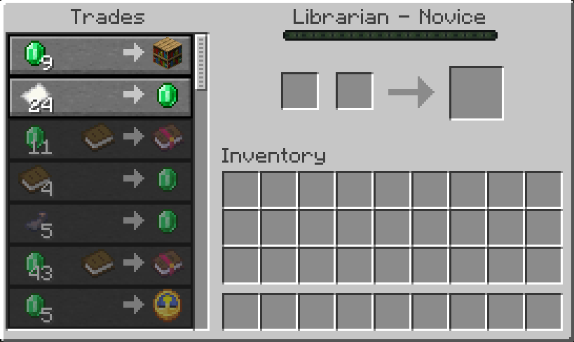

# Villager Trade Peek

See every trade a villager will ever offer before you commit to it.

Villager Trade Peek shows all trades a villager unlocks at future levels, up to Master, right in the vanilla trading screen. Locked trades are drawn greyed out below the trades that are already available, and hovering one tells you which level unlocks it.

This is the Minecraft 1.18.2 version, available for Forge. The Minecraft 1.19.2 version lives on the `1.19.2` branch, the Minecraft 1.20.x version on the `1.20.1` branch and the Minecraft 1.21.x version on the `master` branch.



## Features

- **Full preview up to Master.** Every future trade is listed below the current ones, in level order, and the list scrolls like the vanilla one.
- **What you see is what you get.** Future trades are rolled once, using the vanilla trade pool and vanilla odds, and stored on the villager. When it levels up, it receives exactly the trades you previewed.
- **Locked means locked.** Locked trades are never part of the villager's real offers, so they cannot be selected or used, not even by a modified client.
- **Unlock level tooltip.** Hover a locked trade to see the item tooltip (for example the enchantment on a book) and the level that unlocks it.
- **Your prices.** Locked trades show the price you would pay, including reputation and Hero of the Village discounts, drawn the same way vanilla shows discounts.
- **Rerolling works as expected.** Breaking and replacing a job site block rerolls all future levels along with the level 1 trades. Mods that reroll trades while the trading screen is open update the preview immediately.
- **Modded trades included.** Trades added by other mods through Forge's villager trade event, and tradeable enchantments added by other mods, show up in the preview automatically.
- **Cartographer friendly.** Explorer maps are only created when the villager reaches the level that unlocks them, so rerolling a cartographer stays smooth and does not use up nearby structures.
- **Survives zombification.** A villager that is turned into a zombie villager and cured keeps its future trades.
- **Existing worlds.** Villagers that existed before the mod was installed get their remaining levels generated the first time you open their trading screen.
- **Safe to remove.** Without the mod, villagers simply fall back to vanilla behavior. No trades are leaked or unlocked early.

## Requirements

| | Forge |
|---|---|
| Minecraft | 1.18.2 |
| Loader | Forge 40.2.0 or newer |
| Jar | `villagertradepeek-forge-1.18.2-<version>.jar` |

No configuration needed.

### Client and server

Install the mod on both the client and the server. The mod is required on both sides: players without it cannot join a server that has it; the connection is refused before they enter the world.

## Commands

- `/villagertradepeek future <villager>` (operators only): lists the future trades stored on a villager. Useful when reporting bugs.

## Compatibility notes

Mods that add new trades or tradeable items to villagers work out of the box, because the preview is rolled from the same trade pool vanilla uses. Their trades show up in the preview and are delivered exactly as previewed when the villager levels up.

Mods that change how many trades a villager gets per level, or that replace the villager trade logic entirely, may produce trades that differ from the preview.

## Upgrading a world to Minecraft 1.19.2 or 1.20.1

This version stores future trades in the same format as the Minecraft 1.19.2 and 1.20.x versions of the mod. When a world is upgraded to 1.19.2 or 1.20.1 with the version of the mod for that Minecraft version installed:

- Trades a villager has already unlocked are kept, like in vanilla.
- The stored preview is kept, so villagers still unlock exactly the trades you previewed on 1.18.2, including explorer maps from cartographers.

When a world is upgraded to Minecraft 1.21, the 1.21 version of the mod does not read this format: the preview is rolled again the first time you open the villager's trading screen. Trades already unlocked are kept and nothing is unlocked early.

## Building from source

```
./gradlew build
```

The jar is written to `forge/build/libs`. The project follows the [MultiLoader-Template](https://github.com/jaredlll08/MultiLoader-Template) layout: shared code lives in `common`, Forge-specific code in `forge`.

## License

MIT. See [LICENSE](LICENSE).
